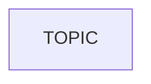

# Lesson LESSON_NN: LESSON_TITLE

One or two sentences: what you can do after this lesson that you could not before.

Prerequisites: lesson(s) `...`. Time: about an hour.

## Concept

The idea, the API in both languages, and the one comparison table or diagram
that makes it click. Code excerpts here point at the real files:
[`PACKAGE_NAME/TOPIC.py`](PACKAGE_NAME/TOPIC.py) and [`src/TOPIC.cpp`](src/TOPIC.cpp).

## Expected output

```bash
colcon build --symlink-install --packages-select PACKAGE_NAME
source install/setup.bash
ros2 launch PACKAGE_NAME TOPIC.launch.py lang:=py
```

```text
[INFO] [TOPIC]: TOPIC started
```

Swap `lang:=cpp` and the output must not change.

## Break it on purpose

1. Change X. Observe Y. Why: ...
2. ...
3. ...

## Node graph



## CLI cheat sheet

| Command | What it shows |
|---|---|
| `ros2 node list` | ... |

## In the wild

Real code that uses this pattern. Each link was opened and checked.

- ...

## Exercises

Solutions live in [`solution/`](solution/README.md). Build them with
`colcon build --cmake-args -DTUT_BUILD_SOLUTIONS=ON`.

1. ...
2. ...
